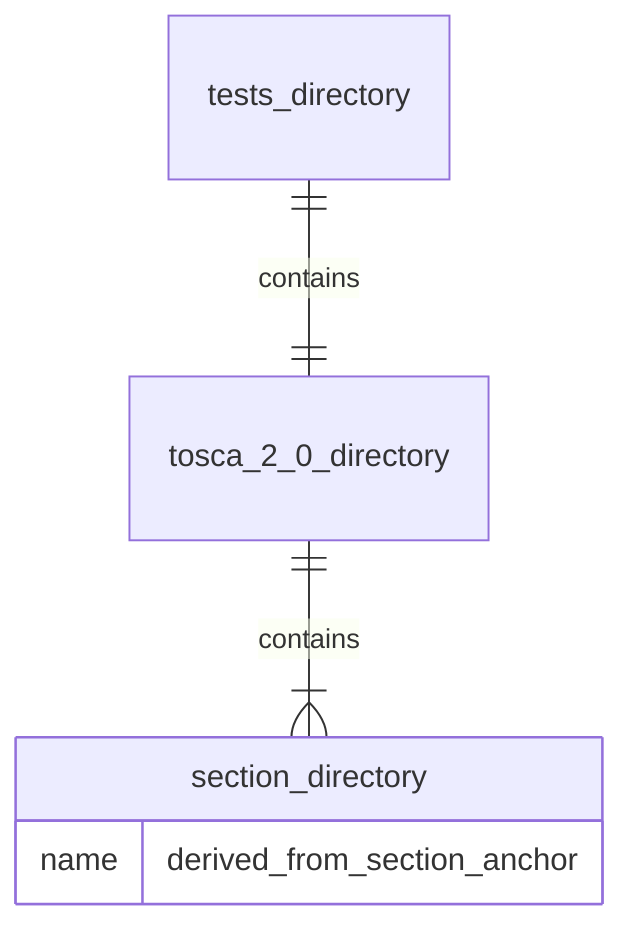
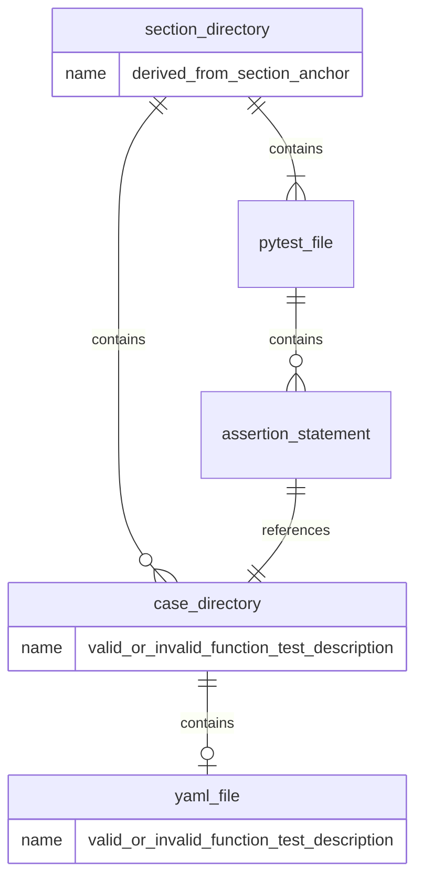
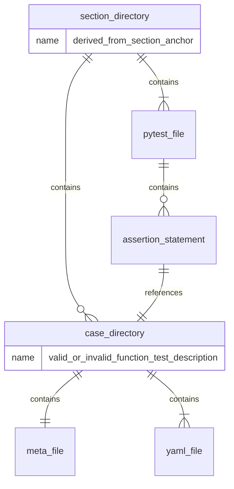
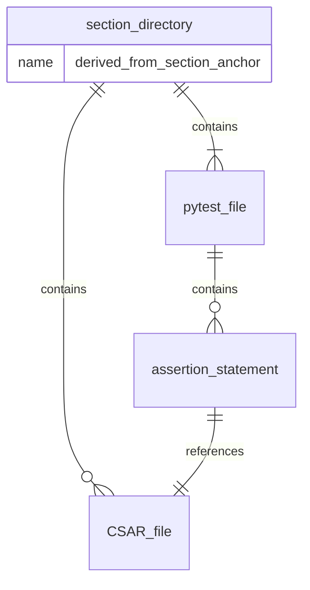

# Framework

## Directory structure
TOSCA test files are held in a directory structure, the top levels of which reflect the paragraph names in the [TOSCA specficiation](https://github.com/oasis-tcs/tosca-specs). The actual directory names are taken from the anchor tags for each paragraph. 



Test files should be placed below the directory which corresponds to the section in which the tested syntax is defined. Some directories may be empty as the corresponding paragraph does not define any syntax.

In most cases only a single TOCSA file will be required for the test. This will be in a sub-directory as shown below:



Sometimes more than one TOSCA file is required (e.g. one file imports another) in which case the sub-directory will contain an expanded CSAR file:



Occasionaly the an unexpanded CSAR may be needed:




## Directory Content

### The TOSCA file
Normally the test file will be TOSCA YAML file. It may also be a TOSCA CSAR file or any file which comprises a TOSCA CSAR file.
There should be test files which are designed to be passed and those which are designed to fail. The TOSCA file and case sub directory should have the same name.

### The pytest file
The expected result is held in as assertion statement which refernces the subdirectory or CSAR. There may be one or more statements in a pytest file. The pytest file will have a similar name to the sub directory with suffix of _test. e.g. if the case sub directory is called valid the pytest file will be named valid_test.py. 

Pytest files are described at [pytest](https://docs.pytest.org/en/stable/#)

Each pytest file will be crafted to match the associated sub directory content although expected that in most cases customization will be minimal. For an example pytest file see ./tests/tosca_2_0/tosca-definitions-version/version_test.py. It assumes the name of the case directory can be derived from its own name.

The pytest file calls a program called wrapper with a reference to the case sub directory. Wrapper provides a standard interface to the TOSCA Processor under test and is further described in [validation](validation.md).

The pytest file includes code to assert that the result is as expected. Wrapper returns a standard set of numbered return codes which cover the expected standard results, these can probably be used in the assert statements for most expected results.

Wrapper also returns a json response containing details of the command which invoked the processor, the raw processor response and a standardized interpretation of those results. The json may be used in more complex assert statements and for debugging. In future it will also contain any TOSCA outputs. Here is an example:

```json
{
  "wrapper": {
    "executedCommand": [
      "my_tosca_tool",
      "--tosca-file",
      "~/tosca-community-contributions/tools/wrapper_tests/tosca/my_tosca_tool/valid.yaml"
    ],
    "success": true,
    "error": false,
    "errorReason": ""
  },
  "processor": {
    "stdout": "PASS\n",
    "stderr": "",
    "return_code": 0
  }
}
